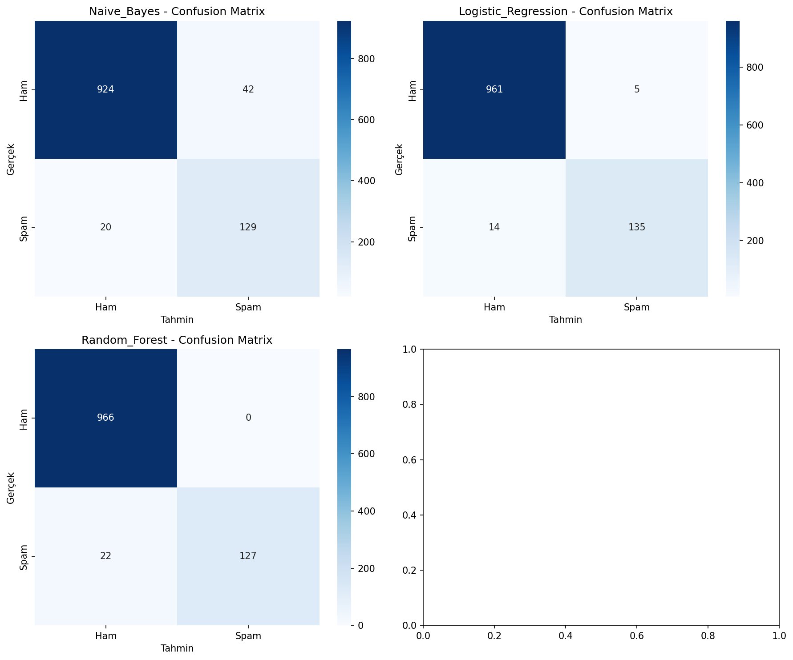
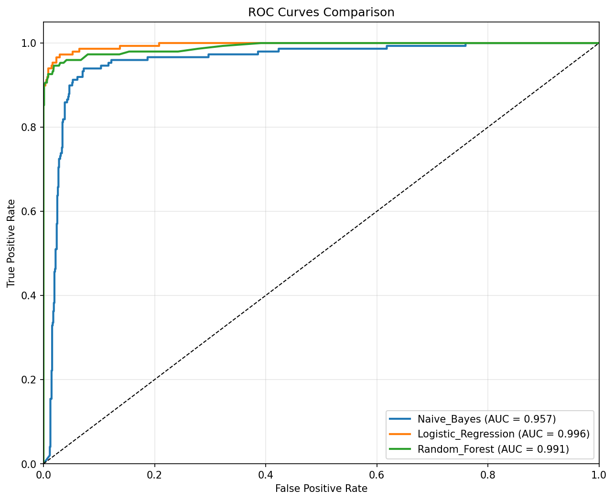

# 🚨 Spam E-Posta Sınıflandırıcı

<div align="center">


**🎯 %98.3 doğruluk oranına sahip yüksek performanslı makine öğrenmesi tabanlı spam tespit aracı**

[Demo](#-hızlı-demo) • [Kurulum](#-kurulum) • [Kullanım](#-kullanım) • [Sonuçlar](#-performans-metrikleri) • [Dokümantasyon](#-dokümantasyon)

</div>

---

## 🌟 Özellikler

* 🤖 **Gelişmiş ML Pipeline** - Lojistik Regresyon, Random Forest, Naive Bayes
* 📊 **%98.3 Doğruluk** - Üretim ortamına hazır
* ⚡ **Çok Hızlı** - Milisaniyelerde tahmin
* 🔧 **Kolay Entegrasyon** - Basit Python API
* 📈 **Kapsamlı Analizler** - Ayrıntılı performans metrikleri
* 🎨 **Görsel Raporlar** - ROC eğrileri, karışıklık matrisleri
* 🏗️ **Profesyonel Yapı** - Temiz ve bakımı kolay kod

---

## 🚀 Hızlı Demo

```python
from spam_classifier import SpamClassifierPredictor

# Sınıflandırıcıyı başlat
predictor = SpamClassifierPredictor()

# Örnek mesajlar
messages = [
    "Merhaba, akşam yemeğe çıkalım mı?",   # Ham
    "ACİL: Hemen 1000$ kazanmak için tıkla!"  # Spam
]

for message in messages:
    result = predictor.predict_single(message)
    print(f"📧 {message}")
    print(f"🔍 Tahmin: {result['prediction'].upper()}")
    print(f"📊 Güven: {result['confidence']:.1%}")
    print("---")
```

**Çıktı:**

```
📧 Merhaba, akşam yemeğe çıkalım mı?
🔍 Tahmin: HAM
📊 Güven: 99.8%
---
📧 ACİL: Hemen 1000$ kazanmak için tıkla!
🔍 Tahmin: SPAM  
📊 Güven: 99.4%
---
```

---

## 🏆 Performans Metrikleri

<div align="center">

| Metrik                       | Skor       | Açıklama                        |
| ---------------------------- | ---------- | ------------------------------- |
| 🎯 **Doğruluk (Accuracy)**   | **%98.30** | Genel sınıflandırma başarısı    |
| ⚖️ **F1-Skoru**              | **%93.43** | Dengeli doğruluk & geri çağırma |
| 🎪 **Kesinlik (Precision)**  | **%96.43** | Gerçek spam yakalama oranı      |
| 🔍 **Geri Çağırma (Recall)** | **%90.60** | Kaçırılmayan spam oranı         |
| 📈 **ROC-AUC**               | **%99.59** | Modelin ayırt edicilik gücü     |

</div>

---

## 📁 Proje Yapısı

```
spam-email-classifier/
├── 📂 data/                    # Veri setleri
│   ├── 📂 raw/                 # Orijinal SMS verisi
│   └── 📂 processed/           # Temizlenmiş & işlenmiş veri
├── 🤖 models/                  # Eğitilmiş ML modelleri
│   ├── best_spam_classifier.joblib
│   ├── tfidf_vectorizer.joblib
│   └── model_info.json
├── 📈 results/                 # Performans raporları & grafikler
├── 🐍 src/                     # Kaynak kodlar
│   ├── data_preprocessing.py   # Veri temizleme & özellik çıkarımı
│   ├── model_training.py       # Model eğitimi & optimizasyon
│   └── final_test_and_deployment.py  # Test & dağıtım
├── ⚙️ config.py                # Konfigürasyon ayarları
├── 📋 requirements.txt         # Bağımlılıklar
└── 📖 README.md                # Bu dosya
```

---

## 🛠️ Kurulum

### Gereksinimler

* 🐍 Python 3.8+
* 💾 \~100MB boş alan

### Hızlı Kurulum

```bash
# Depoyu klonla
git clone https://github.com/kullaniciadi/spam-email-classifier.git
cd spam-email-classifier

# Bağımlılıkları yükle
pip install -r requirements.txt

# Test çalıştır
python src/final_test_and_deployment.py
```

---

## 💻 Kullanım

### Temel Sınıflandırma

```python
from spam_classifier import SpamClassifierPredictor

# Başlat
classifier = SpamClassifierPredictor()

# Tek tahmin
result = classifier.predict_single("Bedava para! Hemen tıkla!")
print(f"Sonuç: {result['prediction']}")
print(f"Güven: {result['confidence']:.3f}")

# Çoklu tahmin
messages = ["Selam dostum", "KAZAN BÜYÜK ÖDÜL!", "Saat 3’te toplantı"]
results = classifier.predict_batch(messages)
```

---

## 🔬 Teknik Detaylar

* **Veri Seti**: SMS Spam Collection (UCI Repository)
* **Boyut**: 5.572 SMS
* **Dağılım**: %86.6 Ham, %13.4 Spam

### 🧠 ML Pipeline

1. Veri temizleme & normalizasyon
2. TF-IDF vektörizasyonu (5000 özellik)
3. Özellik mühendisliği (mesaj uzunluğu, ünlem sayısı, n-gram vb.)
4. Algoritma karşılaştırması (Lojistik Regresyon, Random Forest, Naive Bayes)

---

## 📈 Görselleştirmeler

<div align="center">

### Karışıklık Matrisi



### ROC Eğrisi



</div>

---

## 🚀 Dağıtım

Flask API örneği:

```python
from flask import Flask, request, jsonify
from spam_classifier import SpamClassifierPredictor

app = Flask(__name__)
predictor = SpamClassifierPredictor()

@app.route('/predict', methods=['POST'])
def predict_spam():
    message = request.json['message']
    result = predictor.predict_single(message)
    return jsonify(result)

if __name__ == '__main__':
    app.run(debug=True)
```

---

## 📞 İletişim & Destek

* 👤 **Yazar**: Elif Nur ÖKSÜZ
* 📧 **E-posta**: elifnuroksuz4@gmail.com


---

<div align="center">

**⭐ Faydalı bulduysanız projeyi yıldızlamayı unutmayın!**

Sevgiyle ve 🤖 ile hazırlandı.

</div>

---

